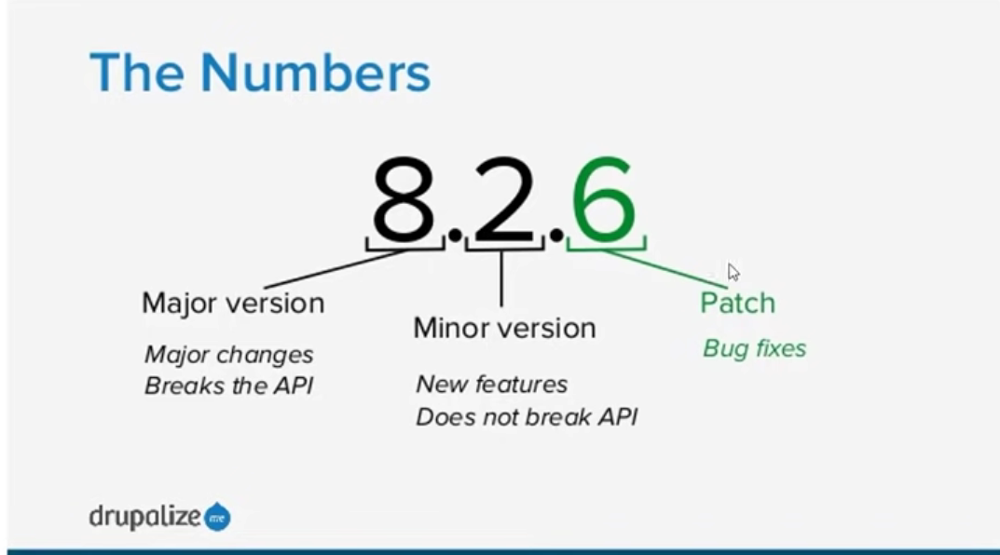

# NPM - Node Package Manager

Requires *NodeJS*.  
Used to install node packages / modules to the project.  

## Brad Traversy commands
### GET VERSION
`npm -v` (or --version)

### GET HELP
`npm help`  
`npm`

## Package.json file
Hold all the dependencies of the application and their versions.

### CREATE PACKAGE.JSON
`npm init`  
`npm init -y` (or --yes)
```json
{
  "name": "npm_notes",
  "version": "1.0.0",
  "description": "",
  "main": "index.js",
  "scripts": {
    "test": "echo \"Error: no test specified\" && exit 1"
  },
  "author": "",
  "license": "ISC",
  "dependencies": {
    "date-holidays": "^3.19.0"
  }
}
```

### SET DEFAULTS
`npm config set init-author-name "YOUR NAME"`  
`npm set init-license "MIT"`

### GET DEFAULTS
`npm config get init-author-name`  
`npm get init-license`

### REMOVE DEFAULTS
`npm config delete init-author-name`  
`npm delete init-license`

### INSTALLING LOCAL PACKAGES
`npm install lodash --save` (or `npm install --save lodash`)  
`npm install moment --save`  
`npm install gulp gulp-sass --save-dev`

### MOVE TO ANOTHER FOLDER
`npm install`  
`npm install --production`  

### REMOVING MODULES
`npm uninstall gulp-sass --save-dev`  
`npm remove gulp --save-dev`  

### INSTALL CERTAIN VERSIONS
`npm install lodash@4.17.3 --save`  

### UPDATE
`npm update lodash --save`  

### INSTALL GLOBAL MODULE
`npm install -g nodemon`  
`npm install -g live-server`  

### RUN NODEMON
`nodemon`

### FIND ROOT FOLDER
`npm root -g`  

### REMOVE GLOBAL PACKAGES
`npm remove -g nodemon`  

### LISTING PACKAGES
`npm list`  
`npm list --depth 0`  
`npm list --depth 1`

### INSTALL LIVE-SERVER LOCALLY
`npm install live-server --save-dev`

### NPM SCRIPT
```json
"scripts": {
    "start": "node index.js",
    "dev": "live-server"
  },
  ```

  ## SEMANATIC VERSIONING
  

  ### Symbols before Dependencies
* `^` - Install the latest minor version
* `~` - Install the latest patch fix with the same minor version
* `*` - Install the latest version(major, minor and patch)